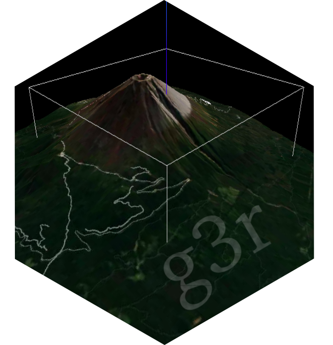
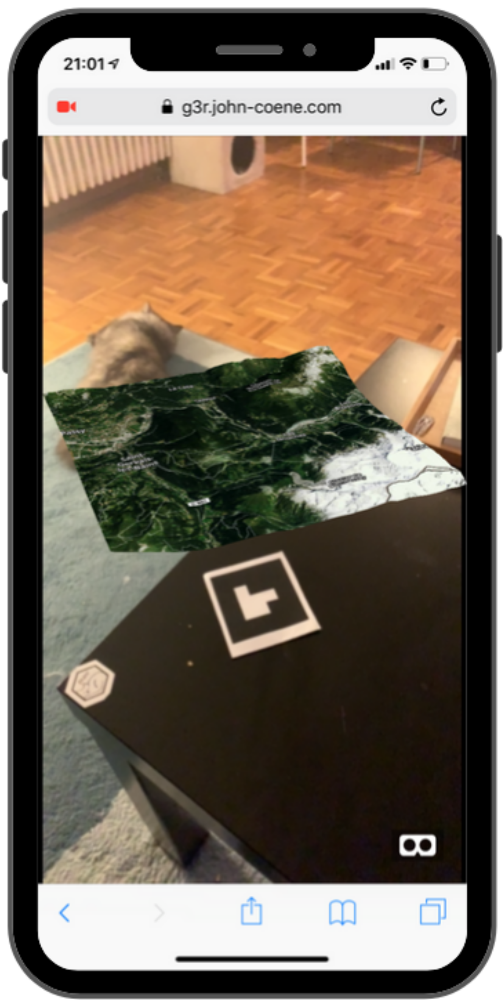

<!-- badges: start -->
[](https://app.netlify.com/sites/g3r/deploys)
<!-- badges: end -->

# g3r



3D, Virtual and Augmented Reality Maps.

## Installation

You can install the released version of g3r from [CRAN](https://CRAN.R-project.org) with:

``` r
# install.packages("remotes")
remotes::install_github("JohnCoene/g3r")
```

[documentation lives here](https://g3r.john-coene.com)

