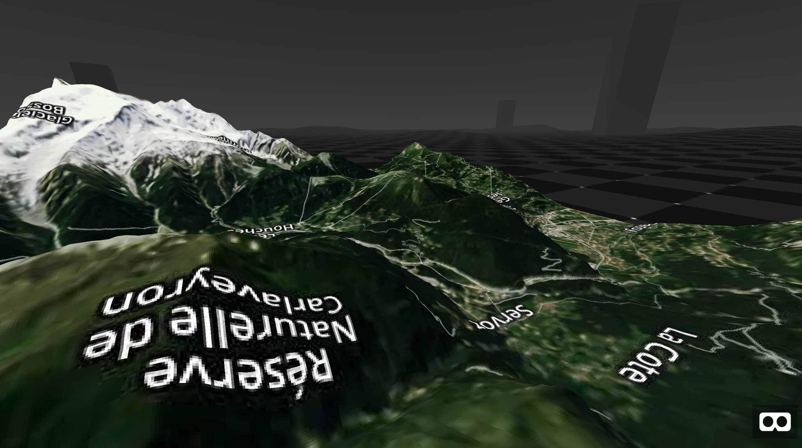
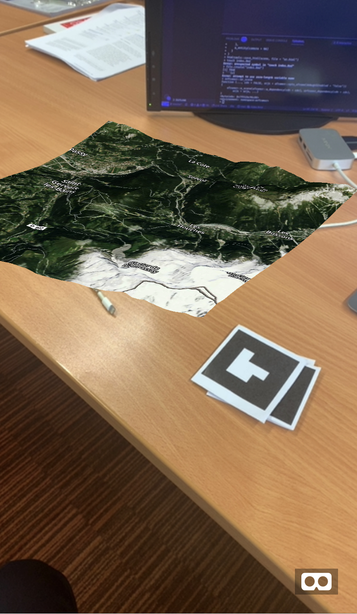

<!-- badges: start -->
<!-- badges: end -->

```{r setup, include = FALSE}
knitr::opts_chunk$set(
  warning = FALSE,
  collapse = TRUE,
  comment = "#>"
)
library(globe4r)
library(htmltools)
```

```{r, echo=FALSE}
br()
div(
  class = "row",
  div(
    class = "col-md-4",
    img(
      src = "logo.png",
      class = "img-responsive responsive-img"
    )
  ),
  div(
    class = "col-md-8",
    p(
      "3D maps for R via",
      tags$a(
        "three-geo.", 
        href = "https://github.com/w3reality/three-geo", 
        target = "_blank"
      )
    ),
    p("Map types:"),
    tags$ul(
      tags$li("WebGL"),
      tags$li("Virtual Reality"),
      tags$li("Augmented Reality")
    )
  )
)
br()
```

## Installation

You can install the g3r from Github:

```r
# install.packages("remotes")
remotes::install_github("JohnCoene/g3r")
```

## Prerequisites

All functions require a freely available [mapbox](https://www.mapbox.com/) API token, by default the function look for the `MAPBOX_TOKEN` environment variable.

## WebGL

Works as an htmlwidget simply call the `g3r` function.

```{r}
library(g3r)

g3r(lat = 36.2058, lon = -112.4413)
```

<details>
<summary>Demo Application</summary>
<p>
```r
g3r::g3r_demo()
```
</p>
</details>

## Virtual Reality

There is also the [aframer](https://aframer.john-coene.com/) component. Note that we run that as a shiny app as the dependency files require to be served.

```r
library(g3r)
library(shiny)
library(aframer)
library(aenvironment) # github/JohnCoene/aenvironment

browse_aframe(
  a_scene(
    a_dependency(),
    g3r_aframer_dependency(),
    aenvironment_dependency(),
    a_environment(
      environment = aframer::opts_aframe(
        preset = "checkerboard"
      )
    ),
    a_map()
  )
)
```



```{r, echo=FALSE}
br()
tags$a(
  class = "btn btn-primary",
  "Virtual Reality Demo",
  href = "vr.html"
)
```

## Augmented Reality

As Augmented Reality with [arframer](https://arframer.john-coene.com/).

```r
library(g3r)
library(aframer)
library(arframer)

browse_arframe(
  a_scene(
    a_dependency(),
    arframer_dependency(),
    g3r_aframer_dependency(),
    arjs = "sourceType: webcam; detectionMode: mono_and_matrix; matrixCodeType: 3x3; debugUIEnabled: false;",
    a_primitive(
      "marker",
      list(
        a_map(),
        type = "barcode",
        value = 1
      )
    ),
    a_entity(camera = NA)
  )
)
```

This will trigger on [artoolkit5 barcode 1](https://raw.githubusercontent.com/artoolkit/artoolkit5/master/doc/patterns/Matrix%20code%203x3%20(72dpi)/1.png) (below), open de demo from your mobile and point your camera at it (if you're on iPhone make sure you use Safari).

/1.png)

```{r, echo=FALSE}
tags$a(
  class = "btn btn-primary",
  "Augmented Reality Demo",
  href = "ar.html"
)
br()
```


